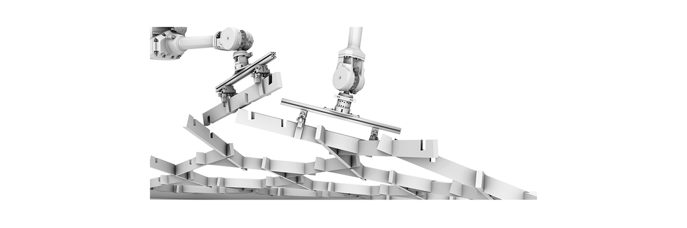

# RLRoboticAssembly

_**NOTE:** This code is not yet public! Stay tuned for updates._



### What is this?

This repository contains code for reproducing and building upon the work described in
_Simulation to Reality: Reinforcement Learning for Robotic Assembly of Timber Joints_.
A video of our results is available [here](https://vimeo.com/359005752/3a1513ed75).

> ABSTRACT -- We demonstrate the first successful application of Reinforcement Learning
for assembly tasks using industrial robots in architectural construction. We focus on
assembly of lap joints in timber structures specifically. We adapt Ape-X DDPG to train
policies entirely in simulation, using force/torque and pose observations, and show that
these policies can be deployed successfully in reality. We also show that these policies
generalize to a fair range of inaccuracy and variation of pose or shape of materials in
the real world.


### Setup

1. Clone repositories.

    ```
    $ mkdir rllib
    $ cd rllib
    $ git clone https://github.com/AutodeskRoboticsLab/rllib
    $ mkdir RLRoboticAssembly
    $ cd RLRoboticAssembly
    $ git clone https://github.com/AutodeskRoboticsLab/RLRoboticAssembly
    ```

2. Optionally, setup virtual environment.

    ```
    $ python3 -m venv pyenv
    $ source activate pyenv
    ```

3. Install requirements.

    ```
    $ (pyenv/) pip3 install -r requirements.txt
    ```

4. Patch rllib.

    ```
    $ (pyenv/) python3 setup-rllib-dev.py
    $ (pyenv/) python3 RLRoboticAssembly/setup/setup-rllib-local.py
    ```


### Example

1. Inspect the simulation.

    ```
    $ python3 viewer.py --taskdir=example
    ```

2. Provide a demonstration.

    ```
    $ python3 demonstrate.py --taskdir=example
    ```

3. Inspect hyperparameters.
    ```
    $ cat tasks/example/hyperparameters/example.yaml
    ```

4. Train a policy.

    ```
    $ python3 train.py --taskdir=example
    ```

5. Rollout a policy.

    ```
    $ python3 rollout.py --taskdir=example --checkpoint=120
    ```


### Notes

- All code is written in [Python 3.6](https://www.python.org/).
- All code was tested on MacOS, Windows, and Ubuntu.
- For licensing information see [LICENSE](docs/LICENSE.md).
- For a list of contributors see [AUTHORS](docs/AUTHORS.md).
- For a list of dependencies see [requirements](requirements.txt).
- For notes on bugs and quirks see [buglist](docs/buglist.md).
- For notes on URDFs and STLs see [urdfs](docs/urdfs.md).
- For notes on input devices see [inputs](docs/inputs.md).


#
