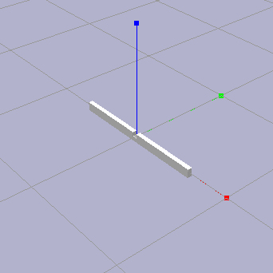
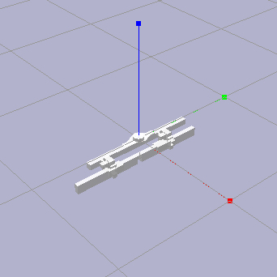
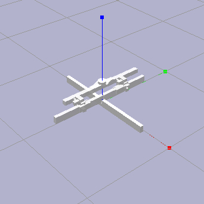

# RLRoboticAssembly


### What is this?

***Simulation to Reality**: Reinforcement Learning for Robotic Assembly of Timber Joints*

_Abstract_ -- We investigate the application of Reinforcement Learning for
assembly tasks using industrial robots in architectural construction, specifically
for lap joints in timber structures. We adapt Ape-X DDPG to train policies in
simulation only, using force/torque and pose observations. We apply a set of
techniques to bridge the gap between simulation and reality and demonstrate that
these policies can be deployed successfully in reality. Our experiments also show
that these policies generalize to a fair range of inaccuracy and variation of pose
or shape of materials in the real world.


### Setup

1. Create folders and clone repositories.

    1. Clone [rllib](https://github.com/AutodeskRoboticsLab/rllib).
    2. In the rllib directory, clone [RLRoboticAssembly](https://github.com/AutodeskRoboticsLab/RLRoboticAssembly).

    After following the procedure above, the folder structure will be as follows:
    ```
    rllib/
    |-- .git/
    |-- setup-rllib-dev.py
    |-- ...
    |-- RLRoboticAssembly/
        |-- .git/
        |-- setup-rllib-local.py
        |-- ...
    ```


2. Install external dependencies.

    1. Optionally, create and activate virtual environment `rlenv` (change name as needed)
    2. Activate the environment.

    ```
    $ python -m venv rlenv
    $ source rlenv/bin/activate
    ```

    After following the procedure above, the folder structure will be as follows:
    ```
    rllib/
    |-- .git/
    |-- rlenv/
    |-- setup-rllib-dev.py
    |-- ...
    |-- RLRoboticAssembly/
        |-- .git/
        |-- setup-rllib-local.py
        |-- ...
    ```

    3. Install the following dependencies:

        - [Ray/Rllib](https://ray.readthedocs.io/en/stable/rllib.html) (version 0.6.3)
        - [pybullet](https://pypi.org/project/pybullet/)
        - [tensorflow](https://pypi.org/project/tensorflow/)
        - [getch](https://pypi.org/project/getch/)
        - [pygame](https://pypi.org/project/pygame/)
        - [transforms3d](https://pypi.org/project/transforms3d/)

        ```
        $ pip install ray[rllib]==0.6.3
        $ pip install pybullet
        $ pip install tensorflow==1.10.0
        $ pip install getch
        $ pip install pygame
        $ pip install transforms3d
        ```

3. Apply patches to installation.

    1. Run `setup-rllib-dev.py`.
    2. Navigate to _RLRoboticAssembly_.
    3. Run `setup-rllib-local.py`.

    ```
    $ python setup-rllib-dev.py
    $ cd RLRoboticAssembly
    $ python setup-rllib-local.py
    ```

Notes:

- This project uses [Python 3.6](https://www.python.org/).

- Installation instructions have been tested in MacOS. This repository has also
  been tested in Ubuntu.

- Note that the above commands may differ based on your system. You may have to
  call a different alias or specify the version of `python` or `pip` explicitly.
  For MacOS, try `python3` and `pip3`.


### Example

Provide a demonstration.

```
python run_env.py --save-demo-data=True --demo-data-path=human_demo_data/example
```

Configure the following:
- Environment hyper-parameters in `envs_launcher.py`
- Training hyper-parameters in corresponding `yaml` file.

Train a model.

```
python train_robot.py -f hyper_parameters/example.yaml
```

Evaluate or rollout a model.

```
python rollout_robot.py trained_models/example/checkpoint-<iteration>/checkpoint-<iteration>
```


### URDF Configuration

- This implementation includes both visual geometry and collision geometry in
  all `urdf` files, however, only the collision geometry is necessary for the
  purposes of training.

- All geometry used for collision and visual models should account for scaling
  in PyBullet. Simulated geometries are measured in _meters_, so models created
  in external software may require scaling in the `urdf` as follows:

  ```
  <geometry>
      <mesh filename="geometry.stl" scale="0.001 0.001 0.001"/>
  </geometry>
  ```

- All geometries (`stl`) used for the purpose of collision detection in any of
  the required `urdf` files _must_ be convex for collision detection to work as
  expected. Geometries used for visualization purposes only are unaffected.



- The _task_ should consist of a partial joint member assembly, such as the above.

- The _task_ should be modeled and configured in the `urdf` such that the target frame
  and the world frame are coincident. When loaded into PyBullet, the target frame
  should appear as such.

- The _task_ parent-child hierarchy  in the `urdf` should be configured as follows:

    ```
    <joint name="task" type="fixed">
        <parent link="base"/>
        <child link="task"/>
        <origin rpy="0 0 0" xyz="0 0 0"/>
        ...
    </joint>
    ```



- The _tool_ should consist of a complete gripper, sensor, and joint member assembly
  such as the above.

- The _tool_ should be modeled and configured in the `urdf` such that the sensor frame
  and the world frame are coincident. When loaded into PyBullet, the sensor frame
  should appear as such.

- The _tool_ parent-child hierarchy in the `urdf` should be configured as follows:

    ```
    <joint name="sensor" type="fixed">
        <parent link="base"/>
        <child link="sensor"/>
        <origin rpy="0 0 0 " xyz="0 0 0"/>
        ...
    </joint>

    <joint name="gripper" type="fixed">
        <parent link="sensor"/>
        <child link="member"/>
        <origin rpy="0 0 0 " xyz="0 0 0"/>
        ...
    </joint>

    <joint name="member" type="fixed">
        <parent link="gripper"/>
        <child link="member"/>
        <origin rpy="0 0 0 " xyz="0 0 0"/>
        ...
    </joint>
    ```

- The _tool_ `inertial` parameters in the `urdf` should be defined for all links,
  however, the `origin` of the `sensor` link should be carefully defined as follows.
  Note that force-torque measurements are to be taken from this location and using
  the index of this link. Note also that this will cause the `sensor` frame to be
  coincident with that of the `base`.

    ```
    <link name="sensor">
        <inertial>
            <origin rpy="0 0 0" xyz="0 0 0"/>
            ...
        </inertial>
        ...
    </link>
    ```



- The _task_ and _tool_ should be positioned in PyBullet such that the _tool_
  is positioned above, nearby, and within reach of the _task_ as shown above.
  The initial position and orientation may change as desired.


### Training configuration

- Trained models should reflect the control rate and delays present in your
  system. In order to train a model that is able to control a system running at
  _n_ Hz, set the private class attribute `Task._time_step` to `1/n` before
  training.


### Input Devices

Input devices are defined in _RLRoboticAssembly/devices_. The base class for an input
device is `InputDevice` or `ThreadedInputDevice` (later, this may become the only
option). At the time of writing, any supported input devices are as -- and are
configured as -- follows.

- Input devices are used in `run_env` and are defined by the input argument
  `--input-type` (`str`). At the time of writing, the supported input types
  can be instantiated by the following arguments: `nothing` or `nth`;
  `pybulletgui` or `pbg`; `spacemouse` or `spm`; `xboxctrl` or `xbc`.

- Most of these devices output a number in the range `[-10, 10]` as defined by
  the class property `scaling` which, by default, is set to `10`. This can be
  modified in the class implementation, during program execution, or using UI
  elements.

- Nothing (`nothing`). This is a simple device used primarily for debugging. It
  is capable of producing random actions in the range `[-1, 1]`, as defined by
  the class property `is_random`.
    ```
    Action  Positive (+)    Negative (-)
    X       -               -
    Y       -               -
    Z       -               -
    RX      -               -
    RY      -               -
    RZ      -               -
    ```

- PyBulletGUI (`pybulletgui`). This device uses the PyBullet GUI to create a set
  of sliders within the simulation window and that can be adjusted using a mouse
  to control the simulated end-effector. This device does not require external
  hardware or drivers. The name of this device is chosen as the default value for
  the input parameter `--input-type` in the program `run_env`.
    ```
    Action  Positive (+)    Negative (-)
    X       X right         X left
    Y       Y right         Y left
    Z       Z right         Z left
    RX      RX right        RX left
    RY      RY right        RY left
    RZ      RZ right        RZ left
    ```

- 3DConnexion SpaceMouse (`spacemouse`). This device uses the 3DConnexion Space-
  Mouse to control the simulated end-effector. This device replicates the method
  of jogging an industrial robot using a 6D joystick, typically located on the
  teach pendant. This device requires external hardware and drivers.
    ```
    Action  Positive (+)    Negative (-)
    X       Right           Left
    Y       Out             In
    Z       Down            Up
    RX      Roll right      Roll left
    RY      Tilt forward    Tilt backward
    RZ      Spin CCW        Spin CW
    ```

- XBox360 Controller (`xboxctrl`). This devices uses a standard XBox360 controller
  to control the simulated end-effector. This device requires external hardware
  and drivers.
    ```
    Action  Positive (+)    Negative (-)
    X       LS right        LS left
    Y       LS up           LS down
    Z       LT pressed      LT pressed + LB pressed
    RX      RS right        RS left
    RY      RS up           RS down
    RZ      RT pressed      RT pressed + RB pressed
    ```


### Bugs, quirks, oddities

- The magnitude of force-torque feedback provided by the simulated sensor in
  PyBullet appears to be greater than that which is provided by the real sensor
  in our experiments. In order to correlate the two, we had to increase the real
  world force-torque feedback by a factor of 5 before providing it as input to
  the machine learning model. The source of this bug is unknown.

- The magnitude of velocity provided by the simulated robot in PyBullet appears
  to be greater than that which is provided by the real robot in our experiments.
  In order to correlate the two, we had to reduce both the linear and angular
  velocity provided by the model by a factor of 5. This comes from the PyBullet
  method `p.changeConstraint()`, which is used to control the simulated tool.

- It is possible in PyBullet for two solid objects to intersect. Any velocities
  which are applied to a geometry in PyBullet should not cause that geometries
  to intersect with any other geometry. Both linear velocities and angular
  velocities are affected.

- The collision detection algorithm used in PyBullet places a small bounding box
  around all geometries and bodies for which collision detection is enabled. The
  dimension of this bounding box is 0.001m greater than the dimensions of that
  geometry. In order to account for this, mating surfaces therein must be "pushed
  back" so that the resulting bounding box corresponds with the actual, nominal
  geometry. Typically, we adjusted the geometry of the member held by the tool.
  Note that assemblies that do not implement this will be impossible to assemble.
  Note that the geometry used for visualization will hide the effects of this.

- The velocities provided by the machine learning model do not ramp away from or
  towards zero at the start or stop point of a task, respectively. The real-world
  motion system must account for this or, otherwise, be capable of starting and
  stopping motion abruptly at these points.

- The distance for a task to be considered complete -- i.e for the tool frame to
  converge with the target frame -- must be positive and nonzero. This should be
  addressed using an `assert` statement elsewhere in the repository.

- Input devices will cause the PyBullet interface to freeze on exit. Reasons for
  this are unknown and will be addressed shortly.


### Notes

- ...


#
