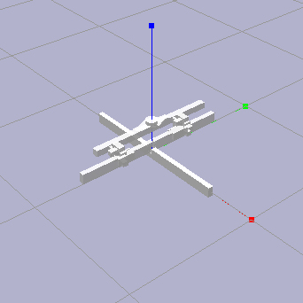
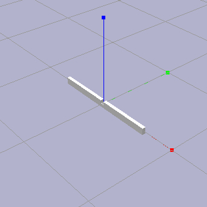
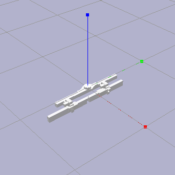

# RLRoboticAssembly

### URDF and STL Configuration

This file details the setup of URDF and STL files associated with this project.



- This implementation includes both visual geometry and collision geometry in
  all `urdf` files, however, only the collision geometry is necessary for the
  purposes of training.

- All geometry used for collision and visual models should account for scaling
  in PyBullet. Simulated geometries are measured in _meters_, so models created
  in external software may require scaling in the `urdf` as follows:

  ```
  <geometry>
      <mesh filename="geometry.stl" scale="0.001 0.001 0.001"/>
  </geometry>
  ```

- All geometries (`stl`) used for the purpose of collision detection in any of
  the required `urdf` files _must_ be convex for collision detection to work as
  expected. Geometries used for visualization purposes only are unaffected.

- The _assembly_ and _tool_ should be positioned in PyBullet such that the _tool_
  is positioned above, nearby, and within reach of the _assembly_ as shown above.
  The initial position and orientation may change as desired.



- The _assembly_ should consist of a partial joint member assembly, such as the above.

- The _assembly_ should be modeled and configured in the `urdf` such that the target frame
  and the world frame are coincident. When loaded into PyBullet, the target frame
  should appear as such.

- The _assembly_ parent-child hierarchy  in the `urdf` should be configured as follows:

    ```
    <joint name="assembly" type="fixed">
        <parent link="base"/>
        <child link="assembly"/>
        <origin rpy="0 0 0" xyz="0 0 0"/>
        ...
    </joint>
    ```



- The _tool_ should consist of a complete gripper, sensor, and joint member assembly
  such as the above.

- The _tool_ should be modeled and configured in the `urdf` such that the sensor frame
  and the world frame are coincident. When loaded into PyBullet, the sensor frame
  should appear as such.

- The _tool_ parent-child hierarchy in the `urdf` should be configured as follows:

    ```
    <joint name="sensor" type="fixed">
        <parent link="base"/>
        <child link="sensor"/>
        <origin rpy="0 0 0 " xyz="0 0 0"/>
        ...
    </joint>

    <joint name="gripper" type="fixed">
        <parent link="sensor"/>
        <child link="member"/>
        <origin rpy="0 0 0 " xyz="0 0 0"/>
        ...
    </joint>

    <joint name="member" type="fixed">
        <parent link="gripper"/>
        <child link="member"/>
        <origin rpy="0 0 0 " xyz="0 0 0"/>
        ...
    </joint>
    ```

- The _tool_ `inertial` parameters in the `urdf` should be defined for all links,
  however, the `origin` of the `sensor` link should be carefully defined as follows.
  Note that force-torque measurements are to be taken from this location and using
  the index of this link. Note also that this will cause the `sensor` frame to be
  coincident with that of the `base`.

    ```
    <link name="sensor">
        <inertial>
            <origin rpy="0 0 0" xyz="0 0 0"/>
            ...
        </inertial>
        ...
    </link>
    ```


### Notes

- ...


#
